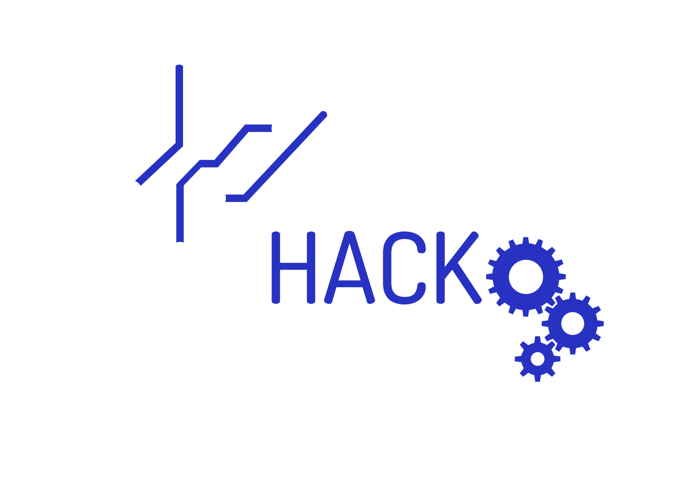

#  HackUMass Website

**Check it out here: [hackumass.com](https://hackumass.com/)!**

## Getting Started

First, run the development server:

npm run dev

Open [http://localhost:3000](http://localhost:3000) with your browser to see the result.

You can start editing the page by modifying `app/page.js`. The page auto-updates as you edit the file.

## How does it work?

- **JavaScript**

  - `components/Landing/WhyHackUmass.js`: Handles the dynamic display of reasons to attend HackUMass.
  - `components/Landing/Faq.js`: Displays frequently asked questions about HackUMass.
  - `components/Landing/Footer.js`: Contains the footer with social media links and a popup for email submission.
  - `components/Landing/Sponsors.js`: Displays the sponsors of HackUMass.
  - `components/Landing/Landing.js`: Main landing page component that includes navigation, hero section, and other sections.
  - `app/layout.js`: Defines the root layout of the application.
  - `components/Landing/Hero.js`: Contains the hero section of the landing page.
  - `components/Landing/OurTeam.js`: Displays the team members of HackUMass.
  - `components/Navbar/Navbar.js`: Navigation bar component.

- **CSS**

  - `components/Landing/Landing.css`: Styles for the landing page.
  - `components/Landing/OurTeam.css`: Styles for the team section.
  - `app/globals.css`: Global styles for the application.
  - `components/Navbar/navbar.css`: Styles for the navigation bar.

- **JSON**
  - `package.json`: Contains the project dependencies and scripts.

## Other Useful Information

### Facing any issues?

If you experience any issues or encounter any bugs, please file an issue on the [GitHub issues page](https://github.com/fuseumass/hackumass-website/issues) for this repository.

### Want your own version with this template?

Feel free to build your own event website by creating a fork and modifying it to your needs! Please make sure that:

- You remove all items from `./assets/` and `./legal/` directories.
- You remove the `CNAME` file with hackumass.com as domain name.
- You give credits to the [contributors and authors](https://github.com/fuseumass/hackumass-website/graphs/contributors) of this repository.
